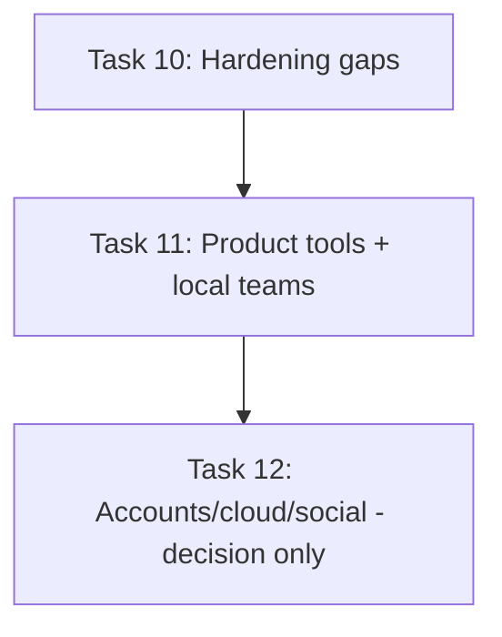

# PokéFinder Remaining Work

Supersedes the deleted `tasks/` folder and `ROADMAP.md`. Verified against
`main` at commit `f883e87` — everything from the old Tasks 01–09 except the
residuals captured in Task 10 below was found implemented in code
(bootstrap + `/pokemon/:nameOrId` routing, failure taxonomy + audio error
states, responsive/a11y search and detail, stale-capable cache with clock +
LRU + schema versioning + deduplication, CI with release build job, browsable
Pokédex + forms discovery, favorites/recents/preferences, species/evolution/
abilities/game-version, release hardening + About screen). It is therefore
safe to delete the old folder and roadmap file; only the work below remains.

> Target platforms are officially **Android and iOS only**. Desktop and Web
> targets are deliberately out of scope.

## Task index

| #      | Document                                                                                                                    | Priority |   Status   |
| ------ | --------------------------------------------------------------------------------------------------------------------------- | -------- | :--------: |
| **10** | [Task 10: Share Links, Localization Gaps and Architecture Consistency](task_10_share_localization_and_architecture_gaps.md) | P1       | `[x]` Complete |
| **11** | [Task 11: Gallery, Comparison, Matchup Calculator and Local Teams](task_11_gallery_comparison_matchup_and_local_teams.md)   | P2       | `[ ]` Open |
| **12** | [Task 12: Accounts, Cloud Sync and Social (Future Epic, Do Not Build Yet)](task_12_accounts_cloud_sync_and_social.md)       | P3       | `[ ]` Open |

## Execution order

Task 10 first (small, closes out the shipped app). Task 11 after (new
product value, offline-first). Task 12 is a decision/spike epic — do not
implement until demand, backend, privacy, and cost are validated.

## Global Definition of Done (applies to Tasks 10–11; Task 12 is exempt)

- [ ] Loading, empty, partial, stale, success, and failure states handled; recoverable failures have retry.
- [ ] User-visible strings localized in English (`app_en.arb`) and Italian (`app_it.arb`); no ALL-CAPS in ARB or UI slugs.
- [ ] Numbers/units use locale-aware `intl` formatting; metric/imperial preference respected.
- [ ] No overflow on small phones, landscape, keyboard open, or 200% text scaling; touch targets ≥ 48×48 dp; screen-reader labels on custom controls.
- [ ] Network work has timeout, cancellation, and cache behavior where relevant; no raw exception strings in UI.
- [ ] Dependencies point inward (presentation → application → domain ← repository); no new `getIt` calls in presentation (see Task 10 §3 for the one pattern to follow).
- [ ] Unit/widget tests for new or changed logic, passing locally.
- [ ] `fvm dart format`, `fvm flutter analyze` (0 issues), and `fvm flutter test` pass.
- [ ] `CHANGELOG.md` updated under `[Unreleased]`; `README.md` updated if features/setup changed.
- [ ] Conventional commit message prepared (e.g. `Added: ...`, `Fixed: ...`), no commit without explicit user request.
