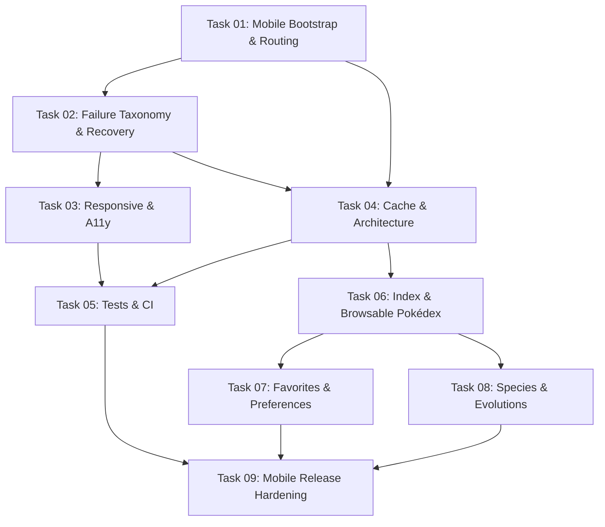

# PokéFinder Mobile Execution Tasks (Android & iOS)

This directory contains the modularized task breakdown for the PokéFinder product and engineering roadmap, derived from [ROADMAP.md](file:///C:/Users/gabri/Documents/GitHub/pokefinder/ROADMAP.md).

> [!NOTE]
> The target platforms for PokéFinder are officially **Android and iOS**. Desktop (Windows, macOS, Linux) and Web targets are deliberately excluded from this execution scope to maximize mobile ergonomics, stability, and speed of delivery.
> The master document [ROADMAP.md](file:///C:/Users/gabri/Documents/GitHub/pokefinder/ROADMAP.md) remains untouched as the historical audit and product backlog.

---

## Roadmap Implementation Plan

| # | Task Document | Roadmap Sections | Target | Priority | Status |
|---|---|---|---|---|:---:|
| **01** | [Task 01: Mobile Bootstrap and Canonical Routing](file:///C:/Users/gabri/Documents/GitHub/pokefinder/tasks/task_01_bootstrap_and_routing.md) | §4.1, §4.3 (PR 1) | Android & iOS | **P0** | `[x]` Done |
| **02** | [Task 02: Failure Taxonomy, Media Error States and Recovery UX](file:///C:/Users/gabri/Documents/GitHub/pokefinder/tasks/task_02_failure_taxonomy_and_recovery.md) | §4.2, §9.1 (PR 2) | Android & iOS | **P0** | `[x]` Done |
| **03** | [Task 03: Mobile Responsive Layouts and Deliberate Accessibility](file:///C:/Users/gabri/Documents/GitHub/pokefinder/tasks/task_03_responsive_and_accessibility.md) | §4.4, §4.5, §4.6 (PR 3) | Android & iOS | **P0** | `[ ]` Open |
| **04** | [Task 04: Cache Correctness, Clean Architecture and Resilience](file:///C:/Users/gabri/Documents/GitHub/pokefinder/tasks/task_04_cache_architecture_and_resilience.md) | §5.1, §5.2, §5.3, §9.2 (PR 4) | Android & iOS | **P0/P1** | `[ ]` Open |
| **05** | [Task 05: Test Suite Expansion, Unused Dependency Cleanup and CI](file:///C:/Users/gabri/Documents/GitHub/pokefinder/tasks/task_05_testing_suite_and_ci.md) | §5.4, §5.5, §9.4 | Android & iOS | **P0** | `[ ]` Open |
| **06** | [Task 06: Pokémon Index and Discovery (Browsable Pokédex)](file:///C:/Users/gabri/Documents/GitHub/pokefinder/tasks/task_06_pokemon_index_and_discovery.md) | §6.1, §6.2, §6.3 (PR 5) | Android & iOS | **P1** | `[ ]` Open |
| **07** | [Task 07: Repeat-Use Features and User Preferences](file:///C:/Users/gabri/Documents/GitHub/pokefinder/tasks/task_07_favorites_recents_and_preferences.md) | §7.1, §7.2, §7.3 (PR 6) | Android & iOS | **P1** | `[ ]` Open |
| **08** | [Task 08: Species, Evolution Depth and Form Consistency](file:///C:/Users/gabri/Documents/GitHub/pokefinder/tasks/task_08_species_and_evolution_depth.md) | §8.1 – §8.5 | Android & iOS | **P2** | `[ ]` Open |
| **09** | [Task 09: Mobile Release Hardening and App Store Readiness](file:///C:/Users/gabri/Documents/GitHub/pokefinder/tasks/task_09_release_hardening_and_compliance.md) | §4.7, §9.3, §9.5, §9.6, §10 | Android & iOS | **P0/Pre-1.0** | `[ ]` Open |

---

## Execution Order & Dependencies

---

## Definition of Done (Applies to all tasks)

Before marking any task as completed:
- [ ] Requirements and acceptance criteria from [ROADMAP.md](file:///C:/Users/gabri/Documents/GitHub/pokefinder/ROADMAP.md) §13 are satisfied for Android and iOS.
- [ ] User-visible strings are localized in both English (`app_en.arb`) and Italian (`app_it.arb`).
- [ ] Error, loading, empty, and offline fallback states are handled gracefully.
- [ ] Unit/widget tests covering new or modified logic are implemented and passing.
- [ ] Code follows the inward Clean Architecture dependency direction.
- [ ] `flutter analyze` runs clean with 0 warnings or errors.
- [ ] Documentation is kept in sync:
  - [ ] `CHANGELOG.md` updated under `[Unreleased]` with concise, non-verbose bullet points.
  - [ ] `README.md` updated if architecture, workflows, setup, or features changed.
- [ ] Prepare a conventional, well-structured commit message matching repository history (e.g. `Added: ...`, `Fixed: ...`, `Refactored: ...`), ready for manual commit upon explicit user request.

