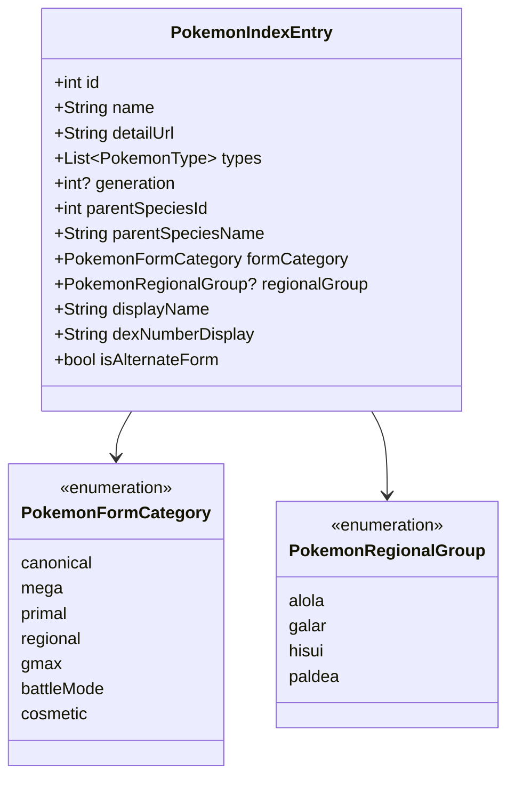

# Task 06.1: Alternate Forms, Megas & Regional Variants Discovery

- **Status:** Complete
- **Roadmap Reference:** [ROADMAP.md §6.1, §6.3, §8.4](file:///C:/Users/gabri/Documents/GitHub/pokefinder/ROADMAP.md#L673-L776), [PR 5 §12](file:///C:/Users/gabri/Documents/GitHub/pokefinder/ROADMAP.md#L1159-L1168)
- **Target Platforms:** Android & iOS only
- **Priority:** P1 (Product Discovery & Pokémon Depth)

---

## 1. Context & Problem Statement

In PokeAPI, Pokémon entries are divided into two distinct numeric bands:
1. **Canonical National Dex Species (IDs 1–1025):** The official species from Bulbasaur (#0001) through Pecharunt (#1025).
2. **Alternate Forms and Variants (IDs 10001–10277+):** Independent battle entities representing Mega Evolutions (e.g. `venusaur-mega`, ID 10033), Regional Variants (`vulpix-alola`, `meowth-galar`, `zorua-hisui`, `wooper-paldea`), Gigantamax forms (`charizard-gmax`), and battle mode shifts (`aegislash-blade`, `giratina-origin`, `deoxys-attack`).

### Current Limitations in the App:
- **Raw API Artifacts:** The raw index query (`pokemon?limit=100000`) treats entries > 10000 as separate Pokémon placed 9,000 slots away from their parent species.
- **Display Oddities:** Cards display raw PokeAPI technical keys like `#10034 charizard-mega-x` instead of official Pokédex styling like `#0006 Charizard (Mega X)`.
- **Generation Filter Breakage:** Because generation mapping uses `id <= 1025`, entries > 10000 have `generation == null` and vanish whenever a Generation filter is active.
- **Cluttered vs Disconnected Discovery:** Users either get an overwhelming list mixed with battle forms and cosmetic Pikachu costumes, or cannot find beloved Mega Evolutions and regional variants when browsing by generation.

Transforming this into a first-class feature elevates PokéFinder from a basic API viewer into an authoritative, curated Pokédex companion.

---

## 2. Technical Architecture & Domain Modeling

### 2.1 Deterministic Parent Species & Category Resolution (Zero Extra Network Requests)
Because the app already loads all 1025 canonical species, we can map every entry > 10000 to its parent species in **O(1)** memory time without making additional network calls:
- Match prefix against canonical species names (e.g. `venusaur-mega` matches canonical `venusaur` -> ID 3).
- Classify `PokemonFormCategory`:
  - `-mega`, `-mega-x`, `-mega-y` -> `PokemonFormCategory.mega`
  - `-primal` -> `PokemonFormCategory.primal`
  - `-alola` -> `PokemonFormCategory.regional` (Alola)
  - `-galar` -> `PokemonFormCategory.regional` (Galar)
  - `-hisui` -> `PokemonFormCategory.regional` (Hisui)
  - `-paldea` -> `PokemonFormCategory.regional` (Paldea)
  - `-gmax` -> `PokemonFormCategory.gmax`
  - Others (e.g. `-origin`, `-attack`, `-therian`, `-zen`, `-crowned`) -> `PokemonFormCategory.battleMode`
  - Cosmetic/Costumes (`-cap`, `-costume`, `-totem`) -> `PokemonFormCategory.cosmetic` (filtered out by default)

### 2.2 Dual Generation Context
Alternate forms have two meaningful generation contexts:
1. **`speciesGeneration`:** The generation of the base species (e.g., Venusaur is Gen 1).
2. **`introductionGeneration`:** The franchise generation when the form debuted:
   - Mega Evolutions / Primal: **Gen 6** (XY, ORAS)
   - Alolan Forms: **Gen 7** (Sun/Moon)
   - Galarian & Gigantamax Forms: **Gen 8** (Sword/Shield)
   - Hisuian Forms: **Gen 8** (Legends: Arceus)
   - Paldean Forms: **Gen 9** (Scarlet/Violet)

Supporting both allows users filtering Gen 7 to discover Alolan Raichu, or filtering Gen 1 to find all Kanto Pokémon including their modern forms.

### 2.3 Official Nomenclature & Localized Formatting
Format raw wire identifiers into polished Pokédex titles:
- `charizard-mega-x` -> `Mega Charizard X`
- `kyogre-primal` -> `Primal Kyogre`
- `vulpix-alola` -> `Alolan Vulpix` / `Vulpix di Alola` (IT)
- `meowth-galar` -> `Galarian Meowth` / `Meowth di Galar` (IT)
- `zorua-hisui` -> `Hisuian Zorua` / `Zorua di Hisui` (IT)
- `wooper-paldea` -> `Paldean Wooper` / `Wooper di Paldea` (IT)
- `gengar-gmax` -> `Gigantamax Gengar` / `Gengar Gigamax` (IT)
- `rotom-wash` -> `Rotom (Wash)` / `Rotom (Lavaggio)` (IT)

---

## 3. Action Items

### 3.1 Domain Modeling & Classification Helper
- [x] Define `PokemonFormCategory` enum (`canonical`, `mega`, `primal`, `regional`, `gmax`, `battleMode`, `cosmetic`).
- [x] Define `PokemonRegionalGroup` enum (`alola`, `galar`, `hisui`, `paldea`).
- [x] Create `PokemonFormClassifier` pure domain utility:
  - Resolves `parentSpeciesId`, `parentSpeciesName`, `formCategory`, and `regionalGroup` by matching against the 1025 canonical species set.
  - Computes `displayName` with proper title formatting and Italian localization support.
  - Maps `introductionGeneration` for all special forms.
- [x] Extend `PokemonIndexEntry` with parent species references, form category, and formatted Dex number (`#0006` with `MEGA X` tag instead of `#10034`).

### 3.2 Browsable Pokédex Presentation Modes
- [x] Update `PokemonIndexFilterHelper` and `PokedexBloc`:
  - **Default Catalog View:** Displays the 1025 canonical species by default to prevent cluttering the Pokédex with battle variants.
  - **Form Indicators on Base Cards:** Display a subtle badge on base cards (e.g. `⚡ Mega`, `🌍 Regional`, `✨ 2 Forms`) indicating that the species has alternate forms.
  - **Form Grouping in Interleaved Mode:** When alternate forms are enabled, sort them *directly beneath their parent species* (e.g. #0003 Venusaur followed immediately by #0003 Mega Venusaur) rather than appending them at index 10001+.
- [x] Add Form Filter controls in `PokedexFilterBottomSheet`:
  - Form Category Segmented Picker: `All Forms`, `Canonical Only`, `Mega Evolutions`, `Regional Forms`, `Gigantamax`.
  - Exclusion toggle for cosmetic/totem variants (`-cap`, `-totem`, `-cosplay`).

### 3.3 Search & Autocomplete Enrichment
- [x] Update `filterPrefixSuggestions` and `PokeTextField`:
  - Support natural searches: typing `"mega"` shows all Mega Evolutions; typing `"alola"` shows all Alolan forms.
  - Searching a Pokémon name (e.g. `"charizard"`) groups the base form and its Mega/G-Max forms together with distinct form badges.

### 3.4 Canonical Navigation & Detail Integration
- [x] Ensure tapping any form card navigates to the canonical `/pokemon/:nameOrId` route with the form pre-selected or directly displays the form's detail.
- [x] Provide seamless transition to [Task 08: Species, Evolution Depth and Form Consistency](file:///C:/Users/gabri/Documents/GitHub/pokefinder/tasks/task_08_species_and_evolution_depth.md#L64-L68).

---

## 4. Acceptance Criteria

- [x] By default, the Pokédex browse page displays a clean, chronological National Pokédex (#0001 to #1025).
- [x] Pokémon cards with alternate forms show a clear visual indicator/badge (e.g., `Mega`, `Regional`, `G-Max`).
- [x] Enabling alternate forms in the filter sheet interleaves forms alongside their parent species with correct `#0001–#1025` numbering and form pills.
- [x] Filtering by Generation respects both the parent species generation and the form's debut generation.
- [x] Filtering by "Mega Evolutions" or "Regional Forms" instantly isolates those categories across all generations.
- [x] Raw wire strings like `charizard-mega-y` or `vulpix-alola` are cleanly localized (e.g., `Mega Charizard Y`, `Alolan Vulpix` in EN; `Vulpix di Alola` in IT).
- [x] Cosmetic forms (costumes, battle totems) do not pollute the primary Pokédex list.
- [x] All classification and parent mapping executes client-side with 0 additional network requests.

---

## 5. Testing & Verification Plan

- [x] **Unit Tests:**
  - `PokemonFormClassifierTest`: Verify parsing for all major categories (Megas, Primals, Alolan, Galarian, Hisuian, Paldean, G-Max, battle modes, cosmetics).
  - Verify O(1) parent species resolution against the 1025 canonical species table.
  - Verify localized title generation in English and Italian.
  - Verify dual generation bounds.
- [x] **BLoC Tests:**
  - `PokedexBloc`: Form category filter toggles, interleaved sorting verification, cosmetic suppression.
- [x] **Widget Tests:**
  - `PokemonCard`: Renders form badges and canonical number tag.
  - `PokedexFilterBottomSheet`: Form category chip selection and reset.
  - `PokedexBrowsePage`: Verifies interleaved ordering (Venusaur -> Mega Venusaur -> Charmander).
